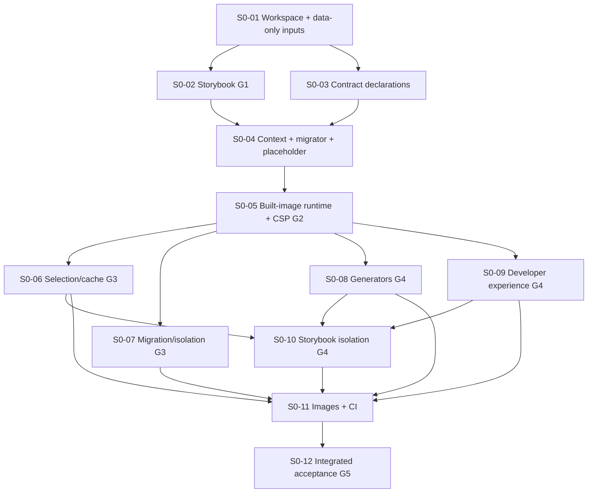

# Spec 0 ticket breakdown

Confidence: 8.0/10. Dependencies preserve the reviewed permanent G2 slice, and each parallel lane has a bounded owner. Exact pinned compatibility and native production startup/header behavior remain unproven until G1/G2; shared lockfile changes still need serialized integration.

Spec 0 and its technical plan were approved for ticket breakdown on 2026-09-19. This is the proposed execution breakdown for review; writing it does not start implementation. Beads owns live status, claims and blocking edges. Markdown owns ticket scope and acceptance, not a second task tracker.

## Authority and scope

- [Approved Spec 0](../../specs/00-monorepo-foundation.md) and [technical plan](../../tech-plans/00-monorepo-foundation.md).
- [ADR 0008](../../adr/0008-foundation-integration-and-generated-registry.md), [module contract](../../architecture/module-contract.md), [environment contract](../../architecture/environment-contract.md), [UI story-first workflow](../../architecture/ui-development.md).
- Twelve work tickets. G1 is S0-02 and G2 is S0-05, not late release checks. G3 is the joined S0-06/S0-07 evidence; G4 combines S0-03/S0-08/S0-09/S0-10 plus preceding gates; G5 is S0-12.
- No design import, application implementation, dependency installation, new worktree, commit, push, publication or Dolt remote sync is performed by this breakdown.
- Sections 1–5 remain unapproved for breakdown. Open design/product questions stay open. Reference-design rechecks are separate work.

Beads epic: `genie-ops-center-v2-1rd`. All twelve children are open and unclaimed at publication; check Beads for current state.

## Ticket index

| Ticket | Bead | Hard prerequisites | Owned result |
| --- | --- | --- | --- |
| [S0-01](01-workspace-and-build-inputs/index.md) | `genie-ops-center-v2-1rd.1` | Planning baseline | Establish workspace, import boundaries and data-only build inputs |
| [S0-02](02-storybook-compatibility-g1/index.md) | `genie-ops-center-v2-1rd.2` | S0-01 | Prove minimal Storybook and component-test compatibility (G1) |
| [S0-03](03-module-contracts-and-build-safe-schemas/index.md) | `genie-ops-center-v2-1rd.3` | S0-01 | Define foundation module contracts and build-safe schemas |
| [S0-04](04-context-migrator-and-placeholder/index.md) | `genie-ops-center-v2-1rd.4` | S0-02, S0-03 | Build permanent tenant-context, migrator and placeholder foundation |
| [S0-05](05-production-startup-and-csp-g2/index.md) | `genie-ops-center-v2-1rd.5` | S0-04 | Prove production startup, one context and minimal CSP (G2) |
| [S0-06](06-selection-cache-and-build-graph/index.md) | `genie-ops-center-v2-1rd.6` | S0-05 | Complete selection-aware application build graph and local cache proof |
| [S0-07](07-migration-concurrency-and-isolation/index.md) | `genie-ops-center-v2-1rd.7` | S0-05 | Complete migration concurrency, recovery and isolation proof |
| [S0-08](08-module-and-tenant-generators/index.md) | `genie-ops-center-v2-1rd.8` | S0-05 | Deliver stage-appropriate module and tenant generators |
| [S0-09](09-developer-experience-and-documentation/index.md) | `genie-ops-center-v2-1rd.9` | S0-05 | Complete developer diagnostics, i18n and UI workflow handoff |
| [S0-10](10-storybook-selection-and-generator-proof/index.md) | `genie-ops-center-v2-1rd.10` | S0-06, S0-08, S0-09 | Complete Storybook discovery, confidentiality and cache matrix |
| [S0-11](11-customer-images-and-ci/index.md) | `genie-ops-center-v2-1rd.11` | S0-06, S0-07, S0-08, S0-09, S0-10 | Complete customer image matrix and Spec 0 CI gates |
| [S0-12](12-foundation-acceptance-g5/index.md) | `genie-ops-center-v2-1rd.12` | S0-11 | Record integrated Spec 0 acceptance and Section 1 handoff (G5) |

## Dependency graph

Edges mean prerequisite code and evidence are integrated, not merely written in another worktree.



The pure data-only resolver begins in S0-01 because G1 story discovery needs the same selection semantics. App-owned registry generation remains in the permanent pre-G2 slice; the full selection/cache matrix stays in S0-06/S0-10. No runtime module import moves into tooling.

## Parallel launch waves

| Start after integration of | Sessions that can run concurrently | Limit |
| --- | --- | --- |
| Approved committed planning baseline | S0-01 only | Foundational manifests/presets must exist first |
| S0-01 | S0-02 and S0-03 | Two; presentation/host versus core declaration ownership |
| Both S0-02 (G1 pass) and S0-03 | S0-04 | One permanent runtime prerequisite owner |
| S0-04 | S0-05 | One production integration/G2 owner |
| S0-05 (G2 pass) | S0-06, S0-07, S0-08, S0-09 | Up to four disjoint primary lanes, shared-file coordination required |
| S0-06 + S0-08 + S0-09 | S0-10 | Can overlap a still-running S0-07 |
| S0-06 through S0-10 all integrated | S0-11 | One image/CI integration owner |
| S0-11 | S0-12 | One integrated acceptance owner |

“Independent” means no development dependency edge between those siblings, not zero possible merge conflict. Don't launch twelve sessions at once. Use current Beads readiness rather than treating this static wave table as live status.

## Shared-file protocol

The integration owner is the user or one explicitly appointed coordinating session. Root package.json, pnpm-lock.yaml, nx.json, shared presets, package exports, root test configuration and agent instruction files are shared surfaces.

Before editing a shared surface, name the paths in the bead and coordinate with active siblings. One writer at a time: agree which session produces the change, integrate it, then have consumers update their baseline. Other sessions may continue work on their owned files. Never resolve a lockfile by taking one side blindly. Worktrees do not prevent semantic conflicts.

S0-01 reserves only a Storybook configuration extension point; S0-02 exclusively owns its actual pins, first shared preset, host and related lockfile/Nx edits. S0-03 owns core public types. S0-06 owns selection/registry/build inputs; S0-07 owns migrator/isolation internals; S0-08 owns generator templates (not the resolver); S0-09 owns devtools/messages. If a public interface must change, synchronize its owner and consumers before implementation continues.

## Starting a Claude Code / Superpowers session

First make the approved planning files available on the agreed integration baseline. The current checkout contains pre-existing tracked and untracked changes; a fresh worktree does not inherit those changes. Do not commit everything or copy the dirty tree blindly. Preparing/committing the baseline needs separate authorization. CLAUDE.md uses feature branches from develop once code exists; if develop is not prepared, ask the integration owner to establish the base rather than silently using main.

The installed bd help states linked Git worktrees discover the shared database via Git common-directory discovery. Verify that claim in each new worktree using bd where and bd worktree info; do not run bd init or create separate issue stores there. The observed coordinator database is .beads/embeddeddolt, not an assumed JSONL store. Same-machine linked worktrees need no remote sync. Separate clones/machines need explicitly coordinated Dolt sync, not this local recipe.

Use Superpowers using-git-worktrees to create or verify one isolated worktree per ticket, never a second nested worktree. Verify the intended integration revision and clean baseline before making edits. [Primary-source notes](superpowers-source-notes.md) describe the verified upstream skills; Beads rules here are the project's coordination overlay.

In the worktree, with a unique session actor:

```bash
rtk proxy bd prime
rtk proxy bd where --json
rtk proxy bd worktree info
rtk proxy bd ready --label spec-0 --type task --json
rtk proxy bd show <bead-id> --json
rtk proxy bd --actor <unique-session-name> update <bead-id> --claim
```

If claim fails, stop; do not overwrite the owner or retry with forced reassignment. Check prerequisite revisions even if the bead is ready. Stop if the worktree cannot see the approved ticket or if its tracker differs from the shared database.

Use writing-plans only for a bounded implementation plan inside this ticket, followed by the applicable executing-plans or subagent-driven-development workflow. Internal subagents stay within the same claimed ticket; don't let them claim sibling tickets or duplicate the coordinator. Repository Beads rules override any generic TodoWrite/second task tracker suggestion. Ticket-local execution plans/recovery notes are not a second status system; keep decisions/blockers/status on the bead.

## Copy-ready session prompt

Replace the two placeholders before sending:

```text
Implement only <S0-ticket> / <bead-id> in /home/kenan/work/genie-ops-center-v2 using Superpowers.

Read docs/tickets/spec-0/README.md and that ticket's index.md, approved Spec 0, its technical plan, AGENTS.md and CLAUDE.md. Verify all prerequisite beads are closed with integrated passing evidence, and the worktree base contains their changes plus the approved planning files.

Use one isolated worktree and feature branch from the agreed integration baseline. Verify this worktree shares the coordinator's Beads database, then atomically claim exactly <bead-id> using a unique session actor. If already claimed, missing a dependency or missing the approved baseline, stop and report it.

Create only the bounded implementation plan this ticket needs. Follow Superpowers execution/review, repository TDD and the Storybook-first UI workflow. Preserve G1/G2 stop gates; no silent dependency downgrade, skipped proof, extra pool/custom server, wider authorization, design import or later-section scope.

Respect owned paths and coordinate shared manifest/lockfile/config changes with the integration owner before editing. No git commit, merge, push, publication, Dolt remote sync or worktree deletion without separate authorization.

At completion report changed paths, red/green and gate evidence, exact commands/results, unverified checks, and integration needs on the bead. Keep it open while awaiting integration. Do not close dependencies or start another ticket. The integration owner closes this bead after the integrated revision passes.
```

## Gate evidence and closure

Each gate evidence record belongs with the implementation change (under this ticket directory's evidence.md if a durable report is needed) and is linked from the bead. Record integrated revision, exact versions, commands, exit outcomes, meaningful negative cases, changed paths, unverified limits and reviewer disposition. Do not fill an evidence file with planned successes.

Failed G1 keeps S0-04 and runtime descendants blocked; S0-03 may continue independent declarations. Failed G2 keeps S0-06–S0-12 blocked. Reopening a gate invalidates dependent readiness: the integration owner pauses already-started descendants and rechecks their baseline. Closing the bead before integration would incorrectly release work.

Any failed proof requiring new architecture, dependency-major change, extra service/pool, forbidden import, authorization weakening, data deletion or confidentiality compromise stops that lane for a user decision. Do not select an alternative silently.

External publication is separate authority: S0-11 tests ordering without pushing customer artifacts. If real GHCR push proof required by AC-8/AC-17 is still unavailable, S0-12 records the outstanding gate and stays open instead of declaring full foundation completion.

## Requirement coverage

[Coverage map](coverage.md) assigns primary owners for every numbered requirement and acceptance criterion. Split ownership means early proof plus later completion, not an excuse for either owner to omit the check.

## Breakdown verification

Independent critique and bounded recheck passed on 2026-09-19 after separating S0-01's extension point from S0-02's exclusive Storybook implementation ownership. Published Beads has the same 18 blocking edges as this map, no cycles and only S0-01 ready. All twelve tickets remain open/unclaimed. Mechanical checks found all 75 numbered requirements and 30 acceptance IDs in the coverage map, valid local links and no whitespace errors. These checks validate the breakdown, not runtime implementation. Recheck current Beads state before dispatch.

Assumptions: one shared same-machine Beads database and one human/coordinator integration owner; future implementation authorization is separate from this breakdown. Unresolved implementation mechanisms remain exactly G1 pinned compatibility and G2 native runtime/header composition. No remaining product question is decided here.
