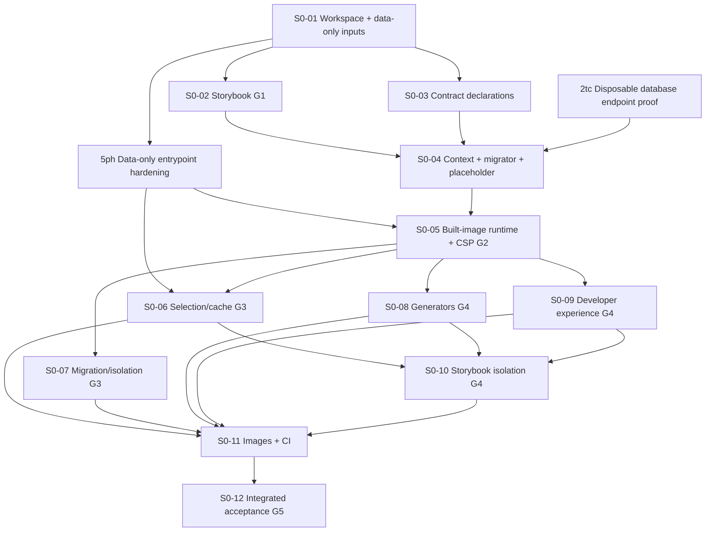

# Spec 0 ticket breakdown

G1 and G2 have integrated acceptance. G2 landed at `3bafa24`; current planning baseline is `6b4edec`, which also includes the formatter-ignore correction. Shared configuration changes and integration still require a single writer. Beads owns current readiness and claims.

Spec 0 and its technical plan were approved for ticket breakdown on 2026-09-19. The breakdown is in execution; the original publication did not itself authorize implementation. Beads owns live status, claims and blocking edges. Markdown owns ticket scope and acceptance, not a second task tracker.

## Authority and scope

- [Approved Spec 0](../../specs/00-monorepo-foundation.md) and [technical plan](../../tech-plans/00-monorepo-foundation.md).
- [ADR 0008](../../adr/0008-foundation-integration-and-generated-registry.md), [module contract](../../architecture/module-contract.md), [environment contract](../../architecture/environment-contract.md), [UI story-first workflow](../../architecture/ui-development.md).
- Twelve work tickets. G1 is S0-02 and G2 is S0-05, not late release checks. G3 is the joined S0-06/S0-07 evidence; G4 combines S0-03/S0-08/S0-09/S0-10 plus preceding gates; G5 is S0-12.
- No design import, application implementation, dependency installation, new worktree, commit, push, publication or Dolt remote sync is performed by this breakdown.
- Section 1 is approved for ticket breakdown (2026-09-23). Sections 2–5 remain unapproved for breakdown. Open design/product questions stay open. Reference-design rechecks are separate work.

Beads epic: `genie-ops-center-v2-1rd`. The [initial audit](audit-2026-09-21.md) records the earlier baseline. Both first-batch lanes integrated: entrypoint repair at `bcd66e7`, S0-04 at `13800cd`. The [integrated review and repair record](04-context-migrator-and-placeholder/integrated-review.md) reopened S0-04, repaired every confirmed finding, completed fresh real-database proof and reaccepted S0-04 at `531e8af`. S0-01 through S0-04 and 5ph are accepted. S0-05/G2 and its yt2/3yv obligations are integrated and closed at the recorded baseline; later tickets still require their own acceptance and integration. Read Beads for current claims and readiness. Beads owns current status; do not redispatch either historical first-batch prompt.

## Execution authority and documentation

Use the repository ticket and its current continuation/authorization record. Specific owner grants supersede generic restrictions below: do not repeatedly request already-granted scoped commits, review, local integration or evidence-based closure. S0-03 has that bounded authority; this does not grant every unstarted ticket local merge rights. Routine Beads updates and Dolt sync are allowed by the owner; code push, deployment and hook activation remain separate permissions.

Keep approved requirements, shared-file rules and durable handoffs in `docs/` with relative links. A session may keep scratch recovery notes, but no other session should need them to discover the approved contract or acceptance result. A fresh worktree must receive the current documentation baseline before implementation; never overwrite newer documentation during integration. Product decisions flow into specifications, then plans/tickets; status and claims remain in Beads.

Preserve accepted decisions and completed work. Routine implementation fixes remain with the delivery owner; escalate genuine product/architecture choices, conflicting writers or incompatible requirements.

## Ticket index

| Ticket | Bead | Hard prerequisites | Owned result |
| --- | --- | --- | --- |
| [S0-01](01-workspace-and-build-inputs/index.md) | `genie-ops-center-v2-1rd.1` | Planning baseline | Establish workspace, import boundaries and data-only build inputs |
| [S0-02](02-storybook-compatibility-g1/index.md) | `genie-ops-center-v2-1rd.2` | S0-01 | Prove minimal Storybook and component-test compatibility (G1) |
| [S0-03](03-module-contracts-and-build-safe-schemas/index.md) | `genie-ops-center-v2-1rd.3` | S0-01 | Define foundation module contracts and build-safe schemas |
| [S0-04](04-context-migrator-and-placeholder/index.md) | `genie-ops-center-v2-1rd.4` | S0-02, S0-03 | Build permanent tenant-context, migrator and placeholder foundation |
| [S0-05](05-production-startup-and-csp-g2/index.md) | `genie-ops-center-v2-1rd.5` | S0-04, 5ph | Prove production startup, one context and minimal CSP (G2) |
| [S0-06](06-selection-cache-and-build-graph/index.md) | `genie-ops-center-v2-1rd.6` | S0-05, 5ph | Complete selection-aware application build graph and local cache proof |
| [S0-07](07-migration-concurrency-and-isolation/index.md) | `genie-ops-center-v2-1rd.7` | S0-05 | Complete migration concurrency, recovery and isolation proof |
| [S0-08](08-module-and-tenant-generators/index.md) | `genie-ops-center-v2-1rd.8` | S0-05 | Deliver stage-appropriate module and tenant generators |
| [S0-09](09-developer-experience-and-documentation/index.md) | `genie-ops-center-v2-1rd.9` | S0-05 | Complete developer diagnostics, i18n and UI workflow handoff |
| [S0-10](10-storybook-selection-and-generator-proof/index.md) | `genie-ops-center-v2-1rd.10` | S0-06, S0-08, S0-09 | Complete Storybook discovery, confidentiality and cache matrix |
| [S0-11](11-customer-images-and-ci/index.md) | `genie-ops-center-v2-1rd.11` | S0-06, S0-07, S0-08, S0-09, S0-10 | Complete customer image matrix and Spec 0 CI gates |
| [S0-12](12-foundation-acceptance-g5/index.md) | `genie-ops-center-v2-1rd.12` | S0-11 | Record integrated Spec 0 acceptance and Section 1 handoff (G5) |

## Dependency graph

Edges mean prerequisite code and evidence are integrated, not merely written in another worktree.



The pure data-only resolver begins in S0-01 because G1 story discovery needs the same selection semantics. App-owned registry generation remains in the permanent pre-G2 slice; the full selection/cache matrix stays in S0-06/S0-10. No runtime module import moves into tooling.

## Current dispatch recommendation

Prepare S0-06/S0-07/S0-08/S0-09 using the [post-G2 handoffs](handoffs/post-g2.md), after this documentation reconciliation is approved and integrated. Reuse the session's task-assigned worktree, including an Orca-created one; only when outside a task worktree, create one with wt from current local develop. Verify the accepted baseline, task ownership and Beads prerequisites. S0-04/5ph/S0-05 prompts are historical, not new dispatches.

The four lanes may develop their owned files concurrently. Preserve the existing shared-file writer order and all eighteen original ticket-to-ticket edges. The coordinator records exact shared-file windows before dispatch and schedules heavy Docker acceptance separately from code ownership. This documentation does not claim any ticket or reserve a window.

CSP logging yt2 is a child of S0-05, and cache identity 2cg is a child of S0-10. Parent sessions deliver these before closure; children are not pre-start dependencies on their own parent implementation. 2cg still requires S0-06. The historical `2tc` database prerequisite is closed; the repair-union database proof is recorded with the integrated review.

`yt2` and `3yv` are integrated and closed; do not reopen or reclaim them. Keep `2cg` manually `blocked` until S0-10 is claimed and all parent prerequisites are integrated. Parent-child links alone do not suppress `bd ready`. The parent owner then atomically transitions and assigns each unassigned child using `bd update <child-id> --if-status blocked --if-assignee '' --status in_progress --assignee <parent-session-actor>`. Record the parent claim and release reason; stop on a failed guard rather than forcing ownership. Do not briefly reopen a child for a separate session to claim.

## Parallel launch waves (whole-ticket gate order)

| Start after integration of | Sessions that can run concurrently | Limit |
| --- | --- | --- |
| Approved committed planning baseline | S0-01 only | Foundational manifests/presets must exist first |
| S0-01 | S0-02 and S0-03 | Two; presentation/host versus core declaration ownership |
| Both S0-02 (G1 pass) and S0-03 | S0-04 | One permanent runtime prerequisite owner |
| S0-04 | S0-05 | One production integration/G2 owner |
| S0-05 (G2 pass) | S0-06, S0-07, S0-08, S0-09 | Up to four disjoint primary lanes, shared-file coordination required |
| S0-06 + S0-08 + S0-09 | S0-10 | Can overlap a still-running S0-07 |
| S0-06 through S0-10 all integrated | S0-11 | One image/CI integration owner |
| S0-11 | S0-12 | One integrated acceptance owner |

“Independent” means no development dependency edge between those siblings, not zero possible merge conflict. Don't launch twelve sessions at once. Use current Beads readiness rather than treating this static wave table as live status.

## Shared-file protocol

The integration owner is the user or one explicitly appointed coordinating session. Root package.json, pnpm-lock.yaml, nx.json, shared presets, package exports, root test configuration and agent instruction files are shared surfaces.

Before editing a shared surface, name the paths in the bead and coordinate with active siblings. One writer at a time: agree which session produces the change, integrate it, then have consumers update their baseline. Other sessions may continue work on their owned files. Never resolve a lockfile by taking one side blindly. Worktrees do not prevent semantic conflicts.

S0-01 reserves only a Storybook configuration extension point; S0-02 exclusively owns its actual pins, first shared preset, host and related lockfile/Nx edits. S0-03 owns core public types. S0-06 owns selection/registry/build inputs; S0-07 owns migrator/isolation internals; S0-08 owns generator templates (not the resolver); S0-09 owns devtools/messages. If a public interface must change, synchronize its owner and consumers before implementation continues.

## Starting a ticket session

Accepted S0-02/S0-03 shared-file sequence (2026-09-20): follow [S0-03's accepted planning decisions](03-module-contracts-and-build-safe-schemas/index.md#accepted-planning-decisions--2026-09-20). After S0-01 is integrated, validated and closed, agree overlapping dependency pins first. S0-03 prepares the minimal contract dependencies; following separate approval and integration of that change, S0-02 updates its baseline and takes over Storybook dependency/configuration edits. Record the writer, paths and integrated revision in both beads. This does not add a whole-ticket S0-03 prerequisite to S0-02 or close either gate; disjoint owned-file work may proceed in parallel. Exports, boundaries and configuration changes also obey the single-writer protocol.

First make the approved planning files available on the agreed integration baseline. A checkout may contain tracked or untracked changes; a fresh worktree does not inherit uncommitted changes. Do not commit everything or copy the dirty tree blindly. Preparing/committing the baseline needs separate authorization. CLAUDE.md uses feature branches from develop once code exists; if develop is not prepared, ask the integration owner to establish the base rather than silently using main.

The installed bd help states linked Git worktrees discover the shared database via Git common-directory discovery. Verify that claim in each new worktree using bd where and bd worktree info; do not run bd init or create separate issue stores there. Use the path reported by bd where; never hardcode a local database layout or treat JSONL as the database. Same-machine linked worktrees need no remote sync. Separate clones/machines use Dolt sync; routine sync is authorized, independently of code pushes.

Start in the session's assigned checkout. If it is already the task's dedicated worktree, including one created by Orca, reuse it. Only when outside a task worktree, use `wt` to create a dedicated branch/worktree from current local `develop`. Verify branch, accepted baseline and task ownership before editing. If the existing worktree belongs to another task or contains conflicting work, stop and ask; do not overwrite it or automatically create another worktree. A continuation preserves its assigned worktree and work. Preserve unrelated changes.

Run these native commands in the worktree, with a unique session actor. Routine Beads sync is allowed. Use `--sandbox` only when a specific task explicitly forbids remote sync; it disables automatic Dolt pushes. Personal command wrappers such as RTK are optional locally and are not prerequisites for these instructions:

```bash
bd prime
bd where --json
bd worktree info
bd ready --label spec-0 --type task --json
bd show <bead-id> --json
bd --actor <unique-session-name> update <bead-id> --claim
```

If claim fails, stop; do not overwrite the owner or retry with forced reassignment. Check prerequisite revisions even if the bead is ready. Stop if the worktree cannot see the approved ticket or if its tracker differs from the shared database.

Internal subagents stay within the same claimed ticket and do not claim sibling tickets. The delivery owner may also claim explicitly named child obligations in its handoff; those are closure requirements, not separate prerequisite sessions. Task-local execution plans and recovery ledgers support the chosen workflow; shared decisions, blockers and status remain on the bead.

## Copy-ready session prompt

Replace `<S0-ticket>`, `<bead-id>` and `<workspace-path>` before sending; use the recipient’s actual checkout path.

```text
Implement only <S0-ticket> / <bead-id>. Start in the session's assigned checkout; use <workspace-path> only when no checkout is assigned.

Read docs/tickets/spec-0/README.md and that ticket's index.md, approved Spec 0, its technical plan, AGENTS.md and CLAUDE.md. Verify all prerequisite beads are closed with integrated passing evidence, and the worktree base contains their changes plus the approved planning files.

Start in the session's assigned checkout. If it is already the task's dedicated worktree, including one created by Orca, reuse it. Only when outside a task worktree, use wt to create a dedicated branch/worktree from current local develop. Verify branch, accepted baseline and task ownership before editing. If the existing worktree belongs to another task or contains conflicting work, stop and ask; do not overwrite it or automatically create another worktree. A continuation preserves its assigned worktree and work. Verify this worktree shares the coordinator's Beads database, then atomically claim exactly <bead-id> using a unique session actor. If already claimed, missing a dependency or missing the approved baseline, stop and report it.

Preserve the repository TDD and Storybook-first UI requirements and G1/G2 stop gates; no silent dependency downgrade, skipped proof, extra pool/custom server, wider authorization, design import or later-section scope.

Respect owned paths and coordinate shared manifest/lockfile/config changes with the integration owner before editing. Follow the ticket-specific execution authority for scoped commits, local merge and closure; do not ask again for actions it already authorizes. Routine Beads sync is allowed. No code push, publication, deployment, hook activation or worktree deletion without explicit authority.

At completion report changed paths, red/green and gate evidence, exact commands/results, unverified checks, and integration needs on the bead. Keep it open while awaiting integration. Do not close dependencies or start another ticket. The authorized integration owner (including an explicitly delegated ticket implementer) closes this bead after the integrated revision passes.
```

## Gate evidence and closure

Each gate evidence record belongs with the implementation change (under this ticket directory's evidence.md if a durable report is needed) and is linked from the bead. Record integrated revision, exact versions, commands, exit outcomes, meaningful negative cases, changed paths, unverified limits and reviewer disposition. Do not fill an evidence file with planned successes.

Failed G1 keeps S0-04 and runtime descendants blocked; S0-03 may continue independent declarations. Failed G2 keeps S0-06–S0-12 blocked. Reopening a gate invalidates dependent readiness: the integration owner pauses already-started descendants and rechecks their baseline. Closing the bead before integration would incorrectly release work.

Any failed proof requiring new architecture, dependency-major change, extra service/pool, forbidden import, authorization weakening, data deletion or confidentiality compromise stops that lane for a user decision. Do not select an alternative silently.

External publication is separate authority: S0-11 tests ordering without pushing customer artifacts. If real GHCR push proof required by AC-8/AC-17 is still unavailable, S0-12 records the outstanding gate and stays open instead of declaring full foundation completion.

## Requirement coverage

[Coverage map](coverage.md) assigns primary owners for every numbered requirement and acceptance criterion. Split ownership means early proof plus later completion, not an excuse for either owner to omit the check.

## Breakdown verification

Independent critique and bounded recheck passed on 2026-09-19 after separating S0-01's extension point from S0-02's exclusive Storybook implementation ownership. At publication, Beads had the same 18 blocking edges as this map, no cycles and only S0-01 ready. At that publication date, all twelve tickets were open/unclaimed; this is historical, not current readiness. Mechanical checks found all 75 numbered requirements and 30 acceptance IDs in the coverage map, valid local links and no whitespace errors. These checks validate the breakdown, not runtime implementation. Recheck current Beads state before dispatch.

Assumptions: one shared same-machine Beads database and one human/coordinator integration owner; future implementation authorization is separate from this breakdown. G1 compatibility is now accepted; G2 is accepted; G3–G5 remain separate acceptance gates. No remaining product question is decided here.

## Module naming revision, 2026-09-20

The approved singular package names and existing capability folders are propagated through [the revision and rework plan](../../tech-plans/module-naming-revision.md). S0-01 enforcement and S0-02 reconciliation are accepted; S0-03 has explicit continuation authority and later tickets inherit the contract. Naming aggregate ygn remains separate from closed enforcement item 1rd.1.4. Existing acceptance gates and the single-writer protocol remain unchanged.
